# GOCATOR COMPUTER VISION - AUTOMATED MEAT THICKNESS MEASUREMENT

**My role**: MANAGER - PRODUCT & PROJECT \
**Skills**: Agile methodologies, Stakeholder Management, Resource Management, User Research and Interviews, Solution Design, Prioritization, Wireframing and prototyping, User testing, Product launch, User Adoption \
**Tools Used**: Clarity, JIRA, Mural, Notion

## Phase 1 - Problem Definition
Today's process of taking sample thickness measurement is inconsistent and fraught with errors. The data from the inconsistent measurements every hour are used to adjust the meat thickness press which leads to errors. Sometimes machine adjustment are not needed and business ends up with customer complaints as well as worst case scenario - product recall, since the meats are too thick which leads to under cooked or the meats are too thin which leads to over cooked, given the time and temperature. 

Manually, calipers are used to measure the thickness of the chicken filet. Example of a target thickness can range from 9-11mm. There is a high degree of variability that comes with measuring the filet. It is possible to end up with 10 different measurements taken by 10 different people. 

#### OBJECTIVE  
Based on the users pain points, I led the product discovery phase. At first we wanted to understand the Baseline Performance, so in order to do so, the team frequently visited the production plant and interviewed multiple stakeholders to gather requirements, data and feedback. When we analyzed the initial-baseline data, we came up the following result:
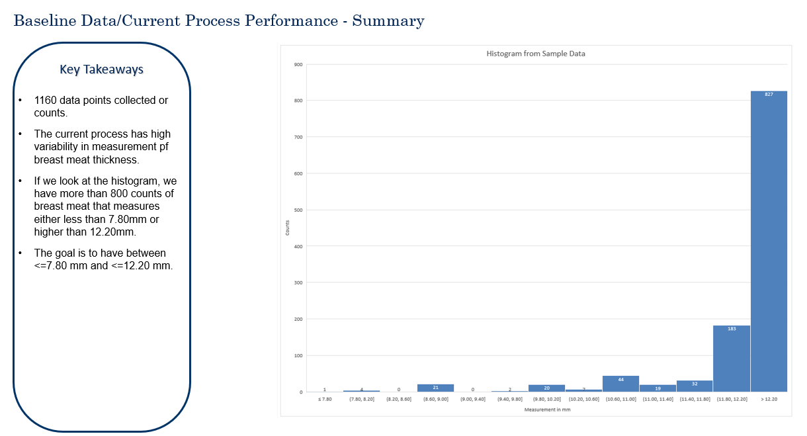

Next, we also needed to validate product hypothesis. 

## Phase 2 - User & Data Research
During the user interview, we found out user experience could be enhanced as team members were manually logging in measurements data in excel sheets, a very tedious tasks for team members.   We also conducted Hypothesis Testing Analysis using baseline data to determine whether the sample mean measurement is significantly greater than 12 inch (thickness). For this, we used t-Test. 
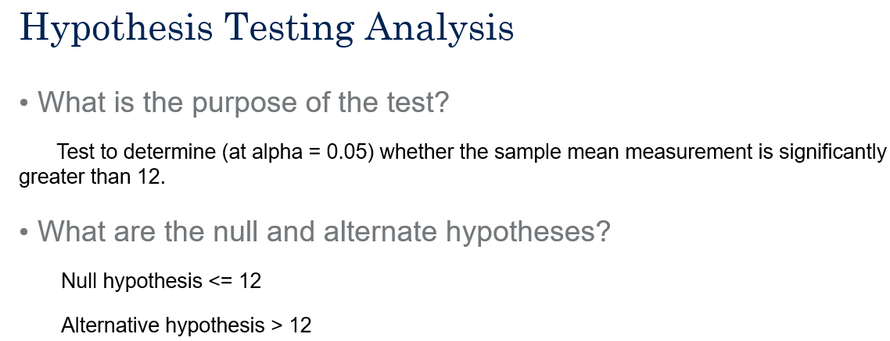
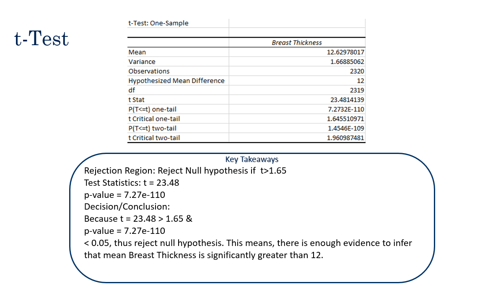

## Phase 3 - Ideation

Using the research findings, I led the team in a ==Brianstorming session.== 
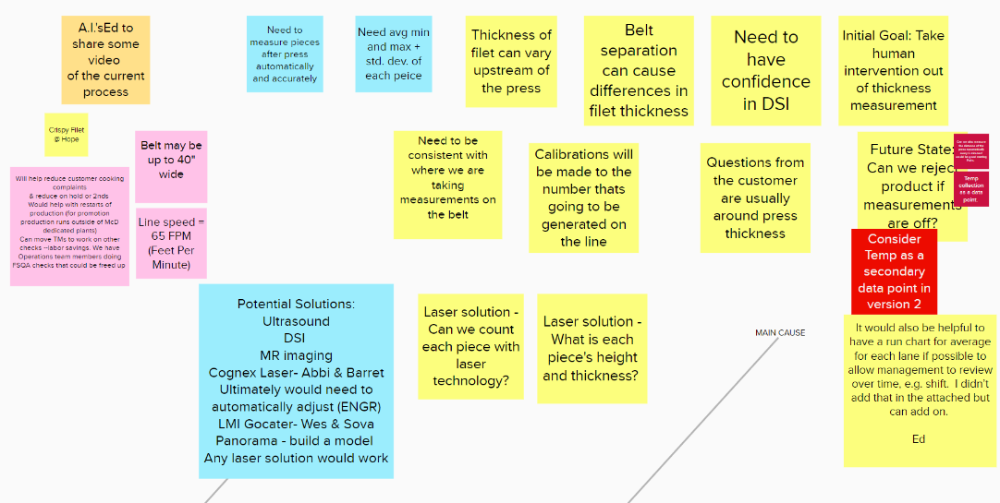

We used Fishbone Diagram and 5 Whys 1 How technique to identify root-cause. 
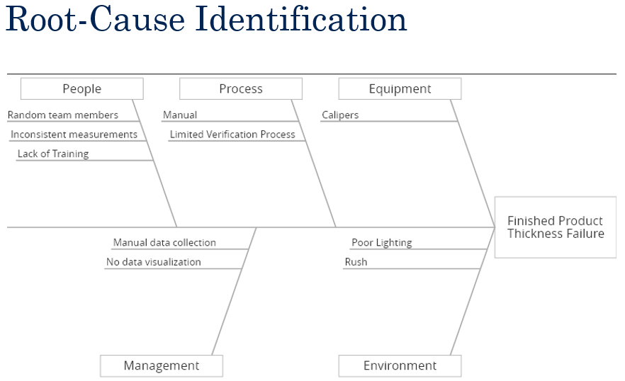
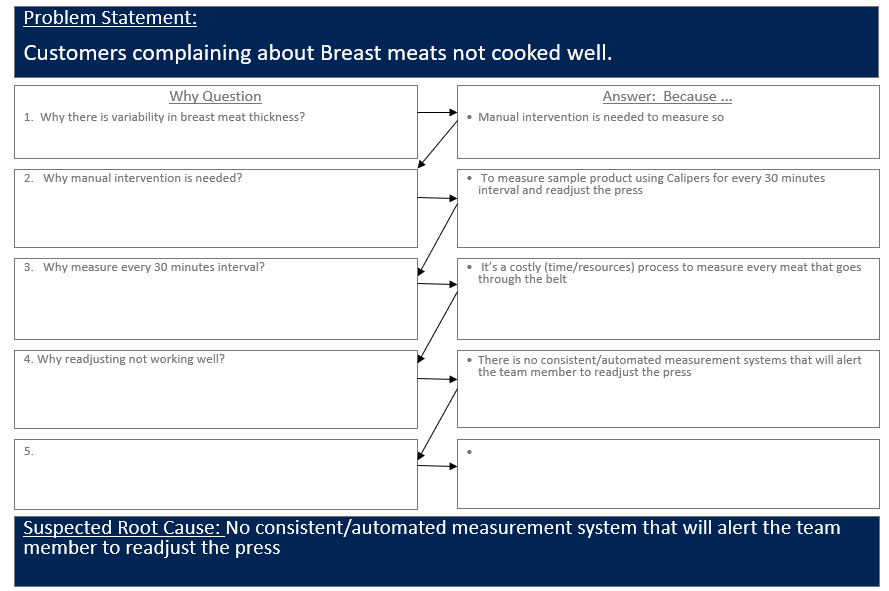

After this, we identified product solutions. 

#### IDEA  
Replace the need for manual checks with an automated approach that will show measurements in real time.  We intend to install a Gocator 3D Camera. 

# Phase 4 - Prototypes & Wireframes
During the development phase used agile prototyping to make quick iterations and gather early user feedbacks. 

#### PROTOTYPING APPROACH
* Create various prototypes that addresses the identified pain points by experimenting with product solution
* Do in person testings to gather quantitative and qualitative data
* Analyze gathered data to iterate 
* Improve prototype and compare old baseline performance against new performance
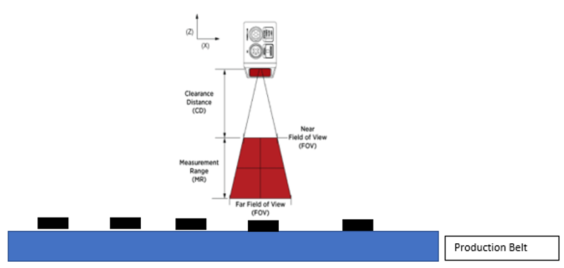
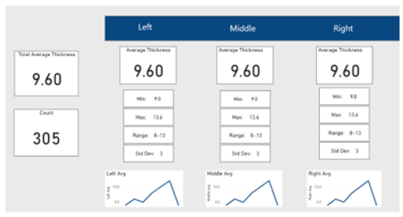

## Phase 5 - MVP
After the brainstorming sessions, iterative prototypes, and user feedbacks, I led the team to present the findings (Cost/Benefits) to senior leadership and key stakeholders to move forward with the MVP. I then used MoSCoW method to prioritize key features to include in our MVP given the budget, resource, and time constraints. Once we finalized the product requirements we got ready for the development. 
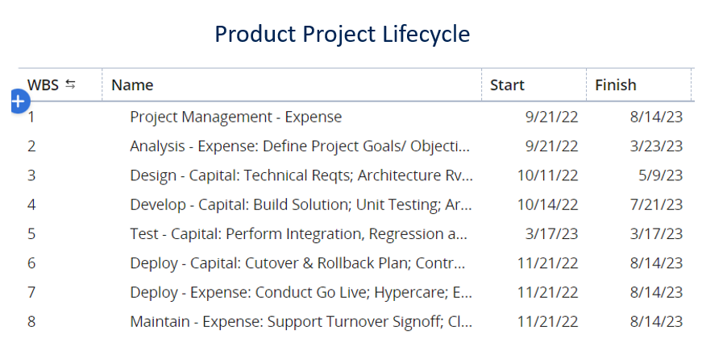
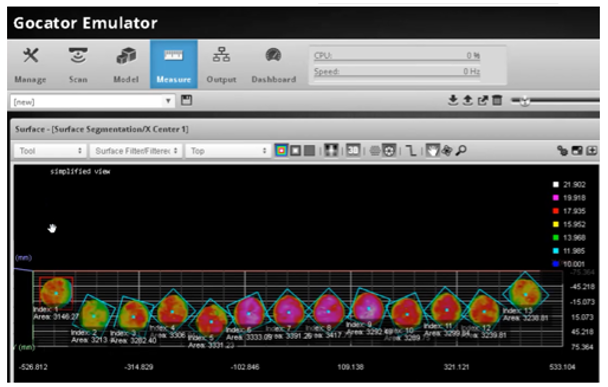
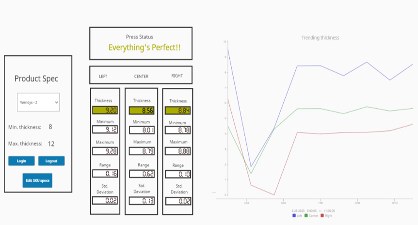

## Phase 6 - Product Launch, Product Growth, & Tracking Metrics
#### LAUNCH PLANNING  
I created a through launch plan that included key stakeholders, internal marketing strategy, product monitoring, and risk mititation strategy. 
The following key performance metrics were monitored on an ongoing basis:  
* Data Collection:  Plant Supervisor, PlantView Application, Real-time basis, and Automated
* Performance Review: Plant Manager, PlantView Application, Weekly, and Use Report

#### PROCESS MONITORING
* Camera has unobstructed view
* Camera wirings must not interfere with daily processes
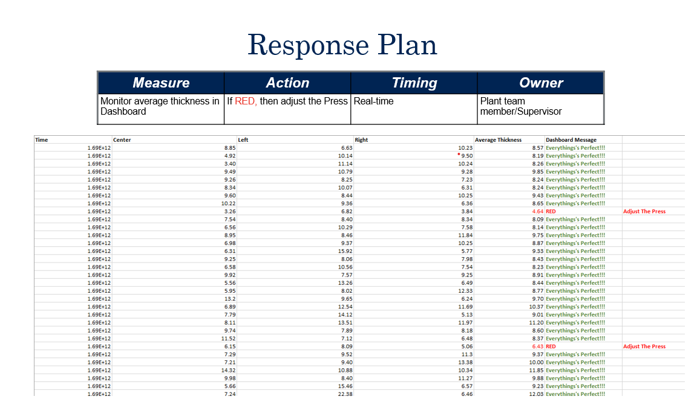

#### PRODUCT GROWTH
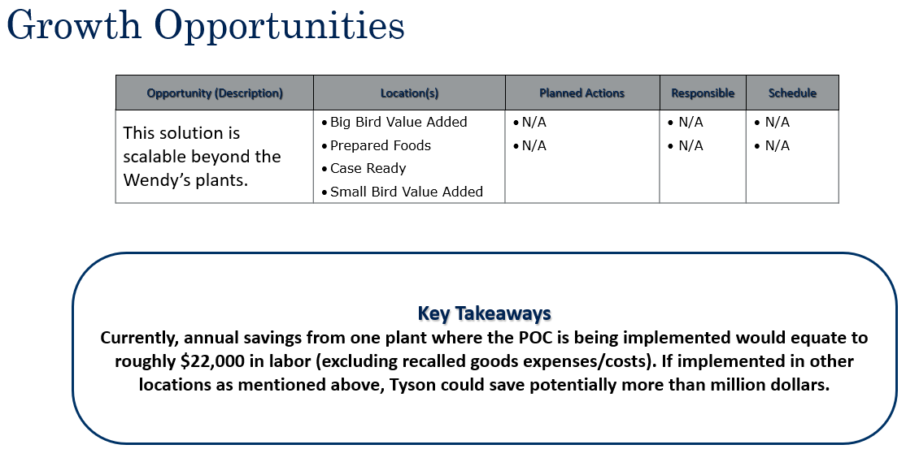

#### METRICS
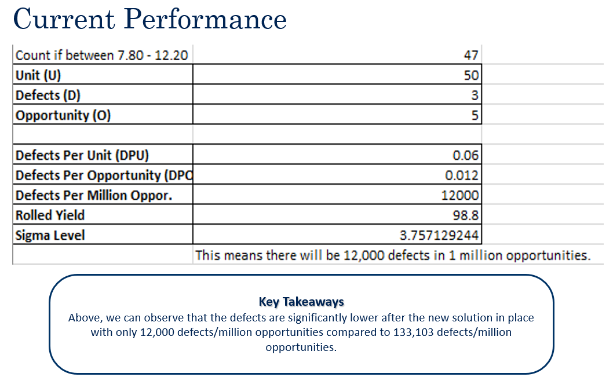

- Achieved **98.9% or more defect-free rate** with potential **saving of more than $3 million**

#### RETROSPECTIVES
Post-launch monitoring and analysis are key for continuous learning and analyze if the launch objectives are being met. Here are some points from lessons learned:
* The development took longer than estimated due to delay in logistics
* Team were not aware of recalibration of Gocator until late in the project

 
