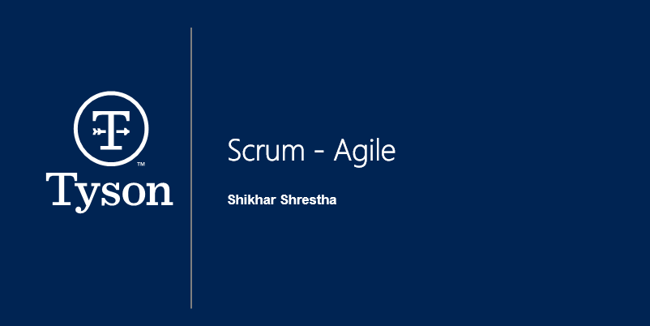
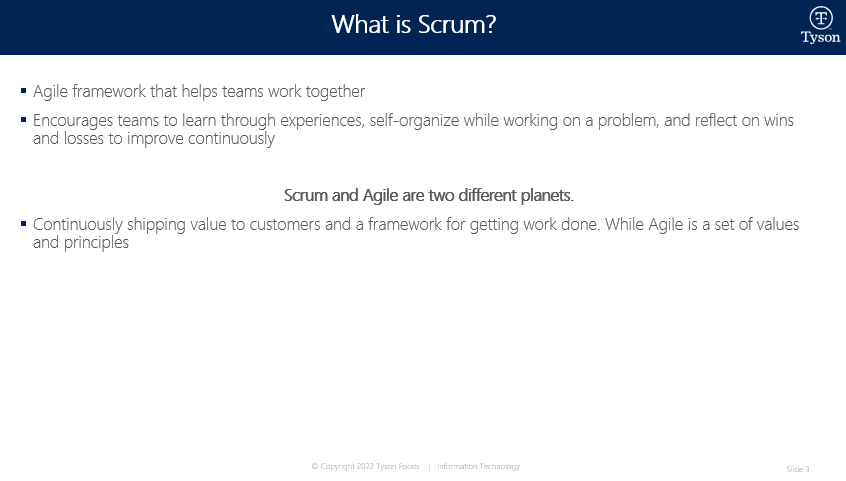
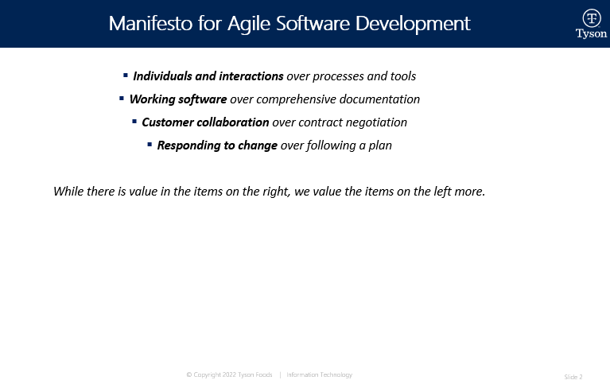
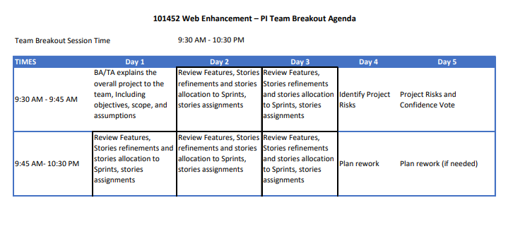
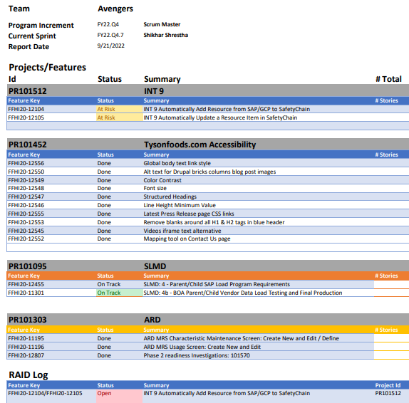
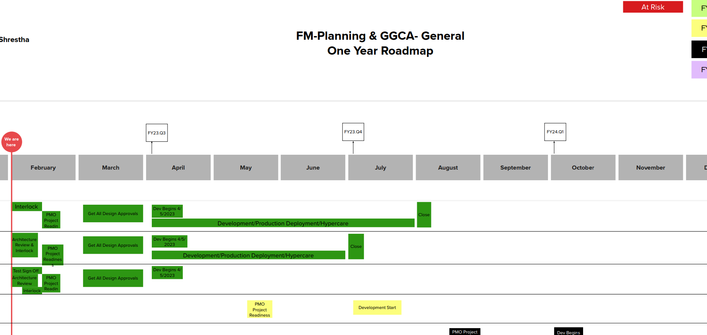

# AGILE PRODUCT - DATA, ANALYTICS AND USER EXPERIENCE (UX/UI)

**My role**: SCRUM MASTER \
**Skills**: Agile Methodologies, Stakeholder Management, Resource Management, Agile Training, Presentation, Requirements Gathering, Features/Stories Creation, Prioritization, User testing, Product launch, User Adoption, Product Demo\
**Tools Used**: JIRA, Mural, Excel

## Problem Definition
Fresh Meats - IT was transitioning from Waterfall to Agile framework and needed agile leader to lead the development efforts fostering continous improvements and product development process that would help teams do their best work. 

## Phase 1 - Introduction
I joined Tyson Foods Inc., as a Scrum Master within Scaled Agile Framework (SAFe) environment where I led the data analytics and UX/UI products. I drove the development of data analytics and user experience (UX/UI) features/requirements where led 10-15 on and off-shore engineers at a time. 

## Phase 2 - Growth
I facilitated Program Increment (PI) planning sessions and all scrum events i.e. Sprint Planning, Daily Stand Up, Sprint Review, Sprint Restrospective, and Backlog Grooming. These sessions helped team build a robust product roadmaps and key deliverables in JIRA. I started providing agile guidance and knowledge to team members via 1:1 or in team settings covering historical background, principles, manifestos, story pointing techniques, and more.  
#### HIGH LEVEL TRAINING DECK I PREPARED/USED

#### PI PLANNING & REPORT EXAMPLES

## Phase 3 - Results
Within 6 months, team attained 30% increase in team velocity. The team maintained 95% on-time delivery rate each Sprints and Quarters and reduced features time-to-market by 20%  through rigourous backlog grooming. We were also able to attain 90% team attendance rate for all scrum events.

## Phase 4 - Next
Currently, I wear Agile Champion hat for IT Business Unit and Value Chain Strategy organization.

## Highlevel Agile Data Analytics & UX Product Roadmap - Example

 
