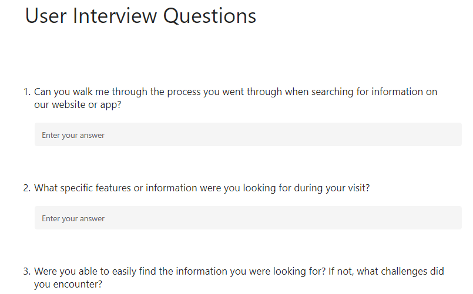
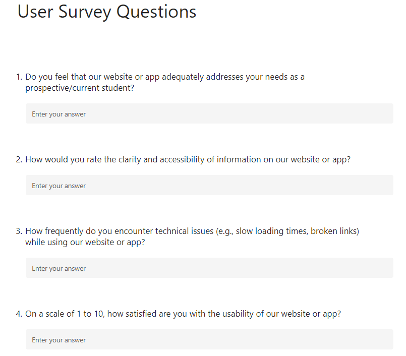
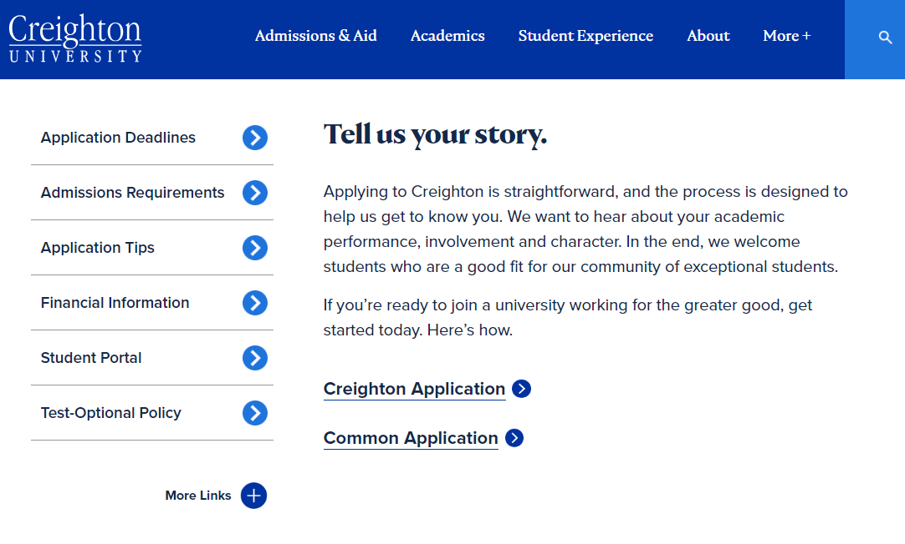
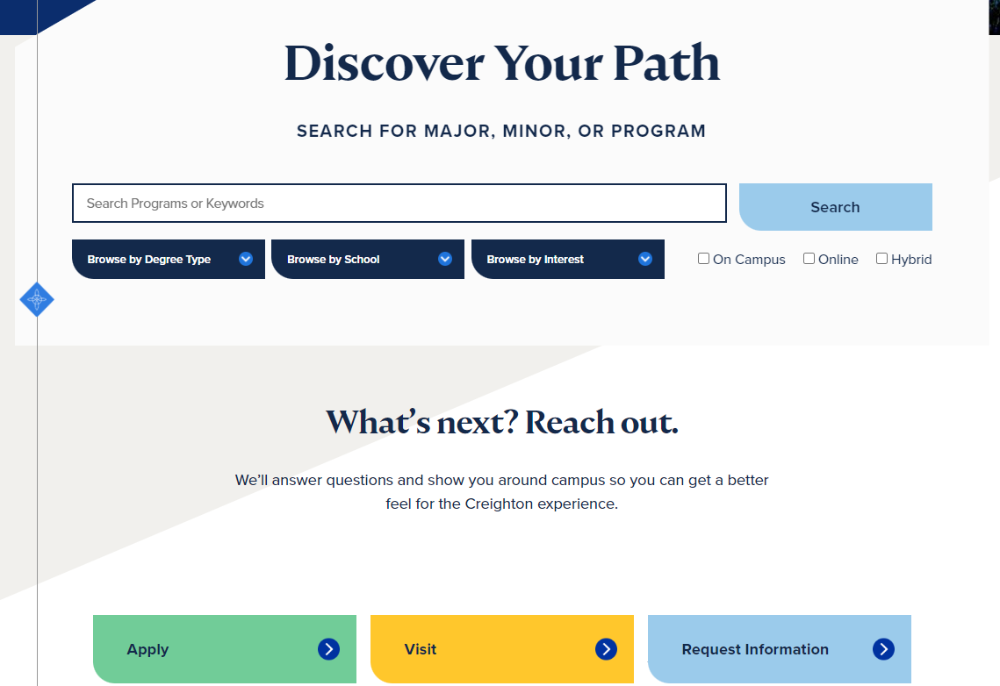

# WEBSITES AND MOBILE APP PRODUCT

**My role**: PRODUCT PROJECT MANAGER \
**Skills**: Agile Methodologies, Stakeholder Management, Resource Management, Vendor Management, User Interviews, Prioritization, Wireframing and prototyping, User testing, Product launch, User Adoption \
**Tools Used**: JIRA, Mural, Excel

## PRODUCT PLANNING
#### Goals and Objectives
* The objective was to update outdated designs to enhance performance and improve user experience. The targeted users were Prospective Students and Current Students.
  
#### Scope and Prioritization
I led team of analysts to conduct a comprehensive audit of existing web pages and mobile apps to identify areas of improvement. We also conducted user interviews and surveys to identify users pain points and preferences.The team also analyzed user feedback from support tickets and other reviews. 

Some of the pain points where users ranked higher were:
* Difficulty Finding Right Information
* Complex Application Process

Based on the user intervies and surveys, using MoSCoW technique, I prioritized the features. The scope was to design changes, functionality enhancements, and performance optimizations. Then, engaged with stakeholders across departments including design, development, and marketing where communicated the objectives, scope, and timeline of the revamp to ensure alignment and gather feedback. 

## PRODUCT DEVELOPMENT LIFECYCLE
#### Development Process
I led 5 developers using agile methodologies, breaking the revamp into manageable sprints and collaborated closely with designers, developers, and QA engineers to implement changes and ensure quality. I conducted regular reviews and retrospectives to evaluate progress and issues.

#### Testing and QA
I led the thorough testing across different devices, browsers, and operating systems to ensure new changes compatibility, performance, and responsiveness. Also, led the team to perform end user testing to ensure intuitive navigation and user-friendly interfaces. The team also addressed bugs, performance issues, or any other concerns identified during testing before the launch. 

## PRODUCT LAUNCH 
The revamped web pages and apps had updated UX/UI design consistent with modern design trends and guidelines. The users were able experience enhanced navigation, user flows, reponsiveness, and reduced page load times. 

**The best feature launched: Program Search Tab with filter options.**

In order to monitor user feedback and performance metrics, we rolled out the changes gradually and started with a beta release. 
